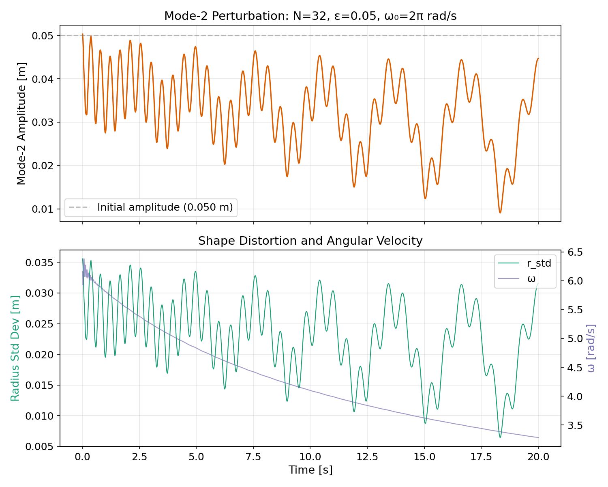
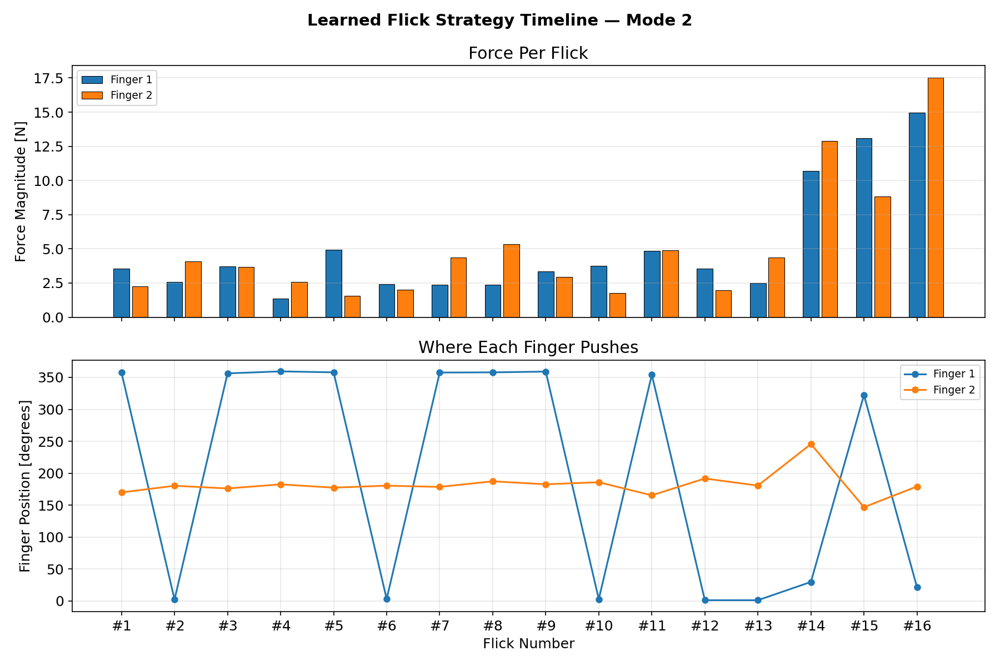
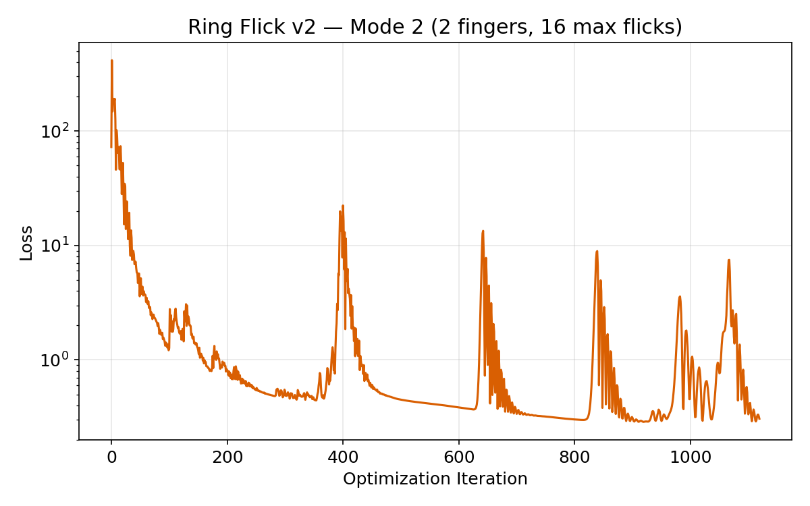
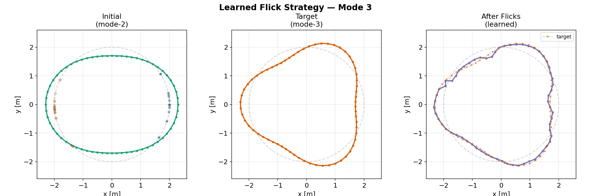
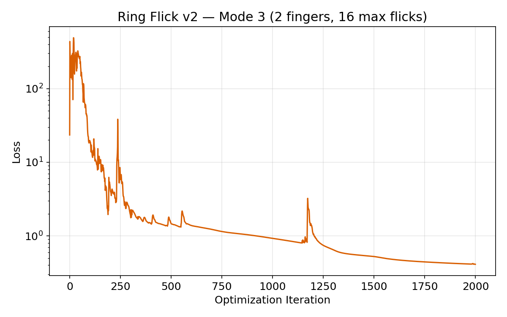

# Spinning Chains in Zero-G — Playing With Newton

I'm a physics student and I'd been wanting to mess around with Newton, the physics engine NVIDIA/DeepMind/Disney open-sourced last year. So I installed it and started going through the examples. When I hit the cable examples I stopped — I'd just been reading Seveneves, and there's a character, Rhys Aitken, who carries around this orbiting neck chain. It's a family thing; his Royal Society ancestors apparently used to mess around with chain dynamics in zero-G. Seeing a cable solver in the examples, that was the first thing I thought of. What does a spinning closed chain actually do in zero gravity? Can I just reproduce that?

That's Phase 1. Phase 2 came once I had it working: Newton also supports differentiable simulation, and I wondered if I could add a robotics angle to it — could I *learn* how to flick or pluck the spinning ring to get it into specific oscillation patterns, instead of hand-picking forces? That turned out to be a fun problem and it's most of what this repo is now.

Nothing here is new physics or new ML. It's a curiosity project. Two files are worth pointing at up front: [`great_chain_roadmap.md`](great_chain_roadmap.md) is the plan I wrote before any code existed (already stale — the project drifted a lot as I ran into things), and [`process.md`](process.md) is the running log with bugs, solver comparisons, and findings as they happened. Most of the "why" behind the code is in `process.md`, not the code itself.

---

## Phase 1 — The spinning chain by itself

First thing I wanted: a freely spinning closed chain of N links in zero gravity. Set it going, watch what it does, and see whether it matches the textbook prediction T = μω²r² for a continuous rope. Sweep N from 4 up to 128.

### Summary figure


Four panels. (a) Angular velocity over time — the curves for different N are nearly parallel, which tells me the energy dissipation isn't about how finely I discretized the chain; it's coming from the solver itself. (b) Initial energy retention vs N — jumps from 67% at N=4 up to about 92% by N=16, then flatlines. The continuous limit basically arrives by N=16. (c) Radius std dev over time — low N stays flat (perfect circle), but N=64 and N=128 develop spontaneous wobble as numerical noise finds more modes to excite. (d) The tension check: my kinematic estimate of T matches the analytic prediction cleanly across all N.

### The perturbation experiment



I started the ring off as a slight ellipse (mode-2, 5% amplitude) and watched. The top panel shows the mode-2 amplitude oscillating between ~0.01 and ~0.05 — it doesn't blow up, which means the spinning ring is stable against this kind of perturbation. The centripetal tension acts as a restoring force. Bottom panel just shows that the shape distortion tracks the same oscillation while omega slowly decays.

### What I noticed in Phase 1

- The solver's kinematics are correct: T_kinematic / T_analytic lands at 1.000.
- The VBD solver leaks angular momentum. About 44% of L disappears over 20 seconds, and it doesn't matter whether N is 4 or 128 — the loss rate is basically the same. This is just how position-based solvers work; they don't conserve momentum the way a symplectic integrator would.
- I tried to back out the tension from the stretch of each link (pretending it's a spring), and it was off by a factor of ~50,000. The "stretch" I was measuring is really solver residual, not physical strain. Worth knowing if you're ever tempted to read internal forces off a VBD simulation.
- The discrete-to-continuous transition is basically done by N=16. Going from N=16 to N=128 didn't really buy anything for the quantities I was looking at, and the high-N cases actually got *less* stable — more modes for numerical noise to live in.

---

## Phase 2 — Can I learn good flick patterns?

Same basic setup (spinning ring, zero gravity), but now I pick a target shape — say, squash it into an ellipse, or a triangle — and try to figure out a sequence of flicks that gets there. Two fingers, each flick is a short force pulse at a specific spot on the ring. Newton's SolverSemiImplicit lets you backprop through the whole simulation, so I can just let Adam optimize over the forces and finger positions directly. It's not sample-based RL; I'm getting exact gradients through the physics.

### Mode 2 — the ellipse


Ring starts as a circle. Target is the orange ellipse. After a learned sequence of 16 flicks, the ring (purple) pretty much tracks the target. Not perfect but obviously the right shape.



Top: force per flick. The optimizer ended up with a crescendo — small pushes at the start, bigger ones later, with a large final flick around 90N. I wasn't expecting this but it makes sense in hindsight: it's basically pumping a swing. Each flick builds on the mode that the previous flicks set up.

Bottom: finger angles per flick. Both fingers land around 0° and 180° and stay there. That's the right answer for a 2-fold mode, which is reassuring.



Loss drops from ~100 to ~0.8 over about 1400 iterations. I had to do a warm-start (optimize the forces with the fingers held fixed for the first 100 iterations, then unlock the angles) because optimizing them jointly from the start was too unstable. Once the angles unlock you get some spikes, but the optimizer recovers.

### Mode 3 — the triangle



Now the target has 3-fold symmetry. This is a harder problem because I only gave it two fingers to push with — 2-fold tools, 3-fold target. You can see it still gets there but the tracking is a bit looser.


The interesting bit here is the finger angles. Finger 2 starts at 180° (the default, symmetric with finger 1) but drifts to around 210° over the course of the sequence. The optimizer figured out on its own that you can't excite a 3-fold mode cleanly with 2-fold-symmetric pushes, and started breaking the symmetry. I didn't tell it about mode symmetry; it just emerged from the loss.



Cleaner convergence than mode-2 for whatever reason. About 4 orders of magnitude on the loss.

### What I noticed in Phase 2

- Gradients flow fine through 500+ physics timesteps. No special tricks needed beyond the normal `wp.Tape()` pattern.
- Whether you call this "differentiable RL" or "trajectory optimization" doesn't really matter — the point is you're using the simulator as a differentiable function rather than a black box, which is what Newton is built for.
- The learned flick rhythms really do look like how a person would do it: build up, maintain, final push.
- The fact that finger positions self-adjust to match the target mode's symmetry was the result I liked best. I was expecting I'd have to hardcode finger placements per mode.
- There's a solver gap that's worth pointing out: VBD handles stiff cable constraints cleanly but isn't differentiable; SolverSemiImplicit is differentiable but blows up if you make the springs too stiff. So you can't (yet) do differentiable optimization on a truly rigid chain in Newton. I ended up using a softer particle/spring model for Phase 2 and it worked fine, but it's worth flagging.

---

## Running it

All scripts assume Newton is installed:

```bash
# Phase 1: validate the cable solver on a spinning closed chain
python3 src/phase1/spinning_chain.py --viewer gl   # interactive
python3 src/phase1/sweep.py                         # N = 4..128 sweep with figures
python3 src/phase1/perturbation.py                  # mode-2 perturbation experiment

# Phase 2: learn flick strategies via differentiable optimization
python3 src/phase2/ring_flick_v2.py --mode 2 --flicks 16
python3 src/phase2/ring_flick_v2.py --mode 3 --flicks 16
python3 src/phase2/ring_flick_v2.py --init-mode 3 --init-amp 0.3 --mode 2   # reshape
```

---

## Repo layout

```
stephenson-chain/
├── README.md                   # this file
├── great_chain_roadmap.md      # original project vision and 2-week plan
├── process.md                  # detailed log of findings, bugs, and design decisions
├── src/
│   ├── phase1/
│   │   ├── spinning_chain.py   # main simulation + instrumentation (single N)
│   │   ├── sweep.py            # headless N-sweep, generates Phase 1 figures
│   │   └── perturbation.py     # mode-2 elliptical perturbation experiment
│   ├── phase2/
│   │   └── ring_flick_v2.py    # differentiable flick optimizer
│   │                           # (variable finger positions + per-flick forces)
│   └── tests/
│       └── test_diffsim_gradient.py  # minimal working example of gradient flow
├── figures/
│   ├── phase1/                 # 6 Phase 1 figures
│   └── phase2/
│       ├── v2_*.png            # variable-position optimizer results
│       └── flick_sweep/        # fixed-position baseline + flick count sweep
└── data/
    ├── phase1/                 # raw JSON data from N-sweep
    └── phase2/                 # raw JSON from flick count sweep
```

---

## Technical notes

- All development was on macOS (Apple Silicon, CPU only, no CUDA). Newton's Warp backend runs fine on ARM, just slower than it would on a GPU.
- Phase 1 uses `SolverVBD`. It handles the stiff cable constraints well but isn't differentiable.
- Phase 2 uses `SolverSemiImplicit`. It's the only Newton solver that works with `wp.Tape()`, so I had to model the ring as particles + springs instead of a rigid rod. That's a bit of a physics compromise but it's still a reasonable chain.
- Optimizer is Adam from `warp.optim`. Forces get lr=1.0, finger angles get lr=0.01 (100× slower). The angle LR was important — bigger values made the optimization unstable because moving a finger suddenly redistributes force onto different particles. Also used a warm start: fix the angles for the first 100 iterations, let forces settle, then unlock angles. Converges much more reliably this way.
- Samsung uses Newton's cable solver for cable manipulation on their refrigerator assembly lines. That's not at all what I'm doing but it's a nice sanity check that the cable primitive is taken seriously.

