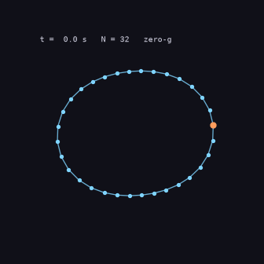
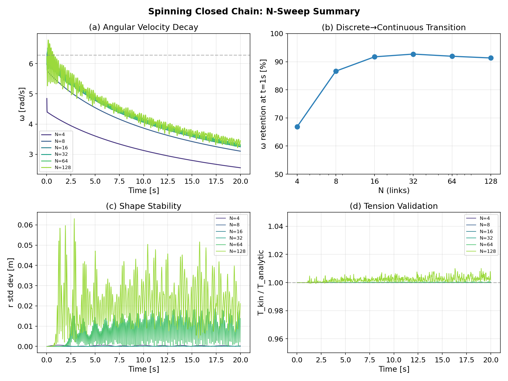
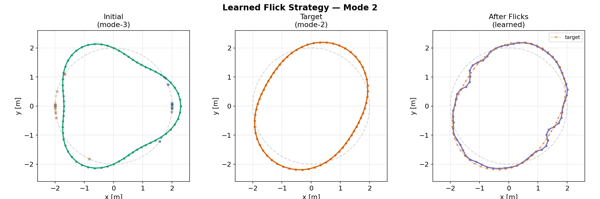
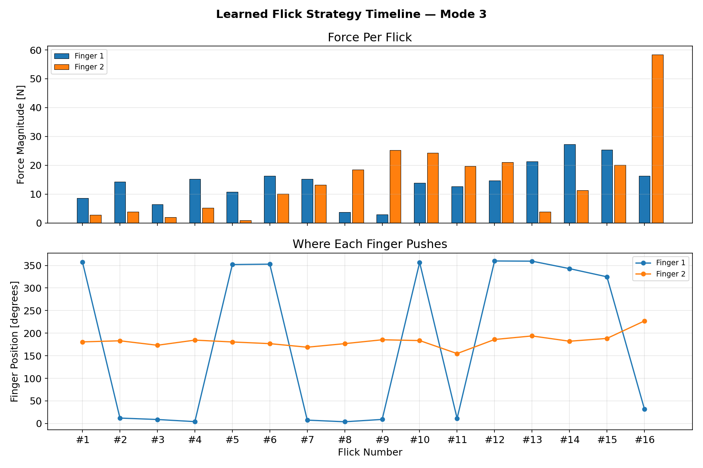

# Spinning Chains in Zero-G — Playing With Newton

I'd just read Seveneves — Rhys Aitken and his orbiting family neck chain — when I hit the cable examples in Newton, the physics engine NVIDIA/DeepMind/Disney open-sourced last year. Obvious question: what does a spinning closed chain actually do in zero gravity? That's Phase 1. Phase 2 happened once it worked: Newton supports differentiable simulation, so instead of hand-picking forces I tried to *learn* how to flick the spinning ring into specific oscillation patterns. Nothing here is new physics or new ML — it's a curiosity project that grew legs.



*A 32-link closed chain spinning in zero-g with an elliptical (mode-2) perturbation. It wobbles but doesn't blow up — centripetal tension keeps pulling it back. Rendered by `src/phase1/render_demo.py`.*

The plan I wrote before any code existed is [`docs/internal/great_chain_roadmap.md`](docs/internal/great_chain_roadmap.md) (already stale — the project drifted a lot). The running log with bugs, solver comparisons, and findings as they happened is [`docs/internal/process.md`](docs/internal/process.md). Most of the "why" behind the code lives there, not in the code.

## Phase 1 — The spinning chain by itself

A freely spinning closed chain of N links in zero gravity, N swept from 4 to 128, checked against the textbook prediction T = μω²r² for a continuous rope.



What I found:

- The solver's kinematics are correct: my kinematic tension estimate matches the analytic prediction at a ratio of 1.000, across all N.
- The VBD solver leaks angular momentum — about 44% of L gone over 20 seconds, at basically the same rate whether N is 4 or 128. Position-based solvers just do this; they aren't symplectic.
- You can't read internal forces off VBD. I tried backing tension out of link stretch (pretending each link is a spring) and got a number off by a factor of ~50,000. The "stretch" is solver residual, not physical strain.
- The continuum limit arrives fast: energy retention flatlines around 92% by N=16, and going to N=128 mostly gives numerical noise more modes to live in.
- Stability: start the ring as a slight ellipse and the mode-2 amplitude oscillates between ~0.01 and ~0.05 instead of growing — tension acts as the restoring force ([figure](figures/phase1/perturbation_mode2.png)).

## Phase 2 — Can I learn good flick patterns?

Same ring, but now I pick a target shape — squash it into an ellipse, or a triangle — and learn a sequence of two-finger flicks that gets there. Newton's `SolverSemiImplicit` backprops through the whole rollout, so Adam optimizes flick forces and finger positions directly. Exact gradients through 500+ physics timesteps, no sample-based RL.



- **Mode 2 (ellipse):** after 16 learned flicks the ring tracks the target. The optimizer found a crescendo — small pushes early, a big ~90 N flick at the end — which in hindsight is just pumping a swing. Fingers settle at 0° and 180°, the right answer for a 2-fold mode ([timeline](figures/phase2/v2_timeline_mode2.png), [convergence](figures/phase2/v2_convergence_mode2.png)).
- **Mode 3 (triangle)** is the result I liked best. Two fingers pushing on a 3-fold target: finger 2 starts at 180° and drifts to ~210° on its own. I never told the optimizer about mode symmetry — it worked out that 2-fold-symmetric pushes can't cleanly excite a 3-fold mode and broke the symmetry itself ([shapes](figures/phase2/v2_shapes_mode3.png), [convergence](figures/phase2/v2_convergence_mode3.png)).



- **Warm-start trick:** joint optimization was unstable, so I hold the finger angles fixed for the first 100 iterations, let the forces settle, then unlock the angles (with a 100× smaller learning rate). Converges much more reliably.
- **Solver gap worth flagging:** VBD handles stiff cable constraints but isn't differentiable; `SolverSemiImplicit` is differentiable but blows up if the springs get too stiff. So you can't (yet) do differentiable optimization on a truly rigid chain in Newton — Phase 2 uses a softer particle/spring ring, which worked fine.

## Running it

Everything ran on a CPU-only Mac (Apple Silicon, no CUDA) — Warp's ARM/CPU fallback is slower but fully functional. Scripts need `numpy`/`matplotlib` (see `requirements.txt`) plus `warp-lang` and `newton`.

```bash
# Phase 1: validate the cable solver on a spinning closed chain
python3 src/phase1/spinning_chain.py --viewer gl   # interactive
python3 src/phase1/sweep.py                        # N = 4..128 sweep with figures
python3 src/phase1/perturbation.py                 # mode-2 perturbation experiment
python3 src/phase1/render_demo.py                  # regenerate figures/demo.gif

# Phase 2: learn flick strategies via differentiable optimization
python3 src/phase2/ring_flick_v2.py --mode 2 --flicks 16
python3 src/phase2/ring_flick_v2.py --mode 3 --flicks 16
python3 src/phase2/ring_flick_v2.py --init-mode 3 --init-amp 0.3 --mode 2   # reshape
```

## Repo layout

```
stephenson-chain/
├── docs/internal/              # roadmap + full process log (the "why")
├── src/
│   ├── phase1/                 # spinning chain, N-sweep, perturbation, demo gif
│   ├── phase2/                 # differentiable flick optimizer
│   └── tests/                  # minimal gradient-flow check
├── figures/                    # all generated figures (phase1/, phase2/, demo.gif)
└── data/                       # raw JSON from the sweeps
```

One last note: Samsung uses Newton's cable solver for cable manipulation on refrigerator assembly lines. Not remotely what I'm doing, but a nice sanity check that the cable primitive is taken seriously.
